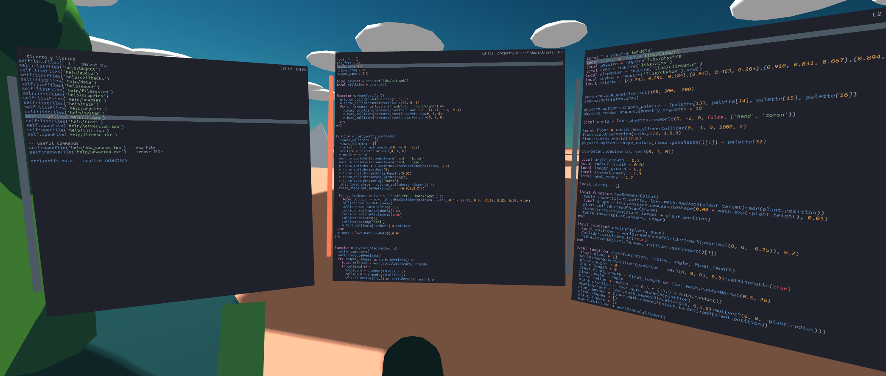

# inDECK development platform

inDECK is a standalone 3D coding environment application for developing the VR from within the VR. The project is written in Lua and runs on top of [LÖVR](https://lovr.org/) framework. LÖVR and inDECK can target all commonly accessible VR platforms.

The main benefit of inDECK environment is a tight iteration loop between Lua code and interpreted 3D runtime. When the code is instantaneously synchronized to the executing runtime, the developing becomes more engaging and productive. Not having to constantly take off and put on the VR headset also eliminates some friction.

The focus platform is Oculus Quest with connected BlueTooth keyboard. Although Quest is considered a consumer platform and target for desktop development, inDECK turns it into a standalone VR development unit. inDECK works in any other environment that can run LÖVR and has the keyboard attached.

At current stage inDECK is functional and useful, but not terribly user-friendly. I use it regularly for VR prototyping and tweaking existing projects. The project is to be a simple and extendable development environment, not a feature-full polished IDE with stable API.

# Description

inDECK consists of a 3D-rendered Lua code editor and the harness for user project execution. Multiple editor instances can be opened and freely positioned in space. A single editor is opened on start and can be used to load and execute any LÖVR project. When the project is executed, it will start running and the main source file will be opened in the code editor. As the user edits the project code, they can occasionally reload the runtime to re-execute the modified code. Both partial reloading and complete environment restarting are supported. If the user introduces an error in their code, the project runtime will be paused, and user gets the chance to quickly fix the mistake with the help of a stack trace and restart the execution.

By design, the inDECK environment can only access files inside the lovr's "save" directory. Any existing LÖVR project should work out-of-the-box inside the inDECK environment once it is copied to the correct location:

* Android: `/sdcard/Android/data/org.indeck.app/files/projects`
* macOS: `/Users/<user>/Library/Application Support/LOVR/indeck/projects`
* Linux: `/home/<user>/.local/share/LOVR/indeck/projects`
* Windows: `C:\Users\<user>\AppData\Roaming\LOVR\indeck\projects`

## Editor

The code editor is pretty standard (if minimal) implementation of text editor with Lua syntax highlighting, mostly modeled after Sublime Text. The editor is driven completely by keyboard shortcuts without any dialogs, popups, or modals. Mouse and VR controller interactions are completely absent to avoid clashes with control handling in user projects.

Note: *the editor never asks to save the changes on closing and* **any unsaved progress is lost**

User can execute a single line of Lua code under the cursor by pressing the *Ctrl+Shift+Enter*. The code is executed in the context of the currently active editor. The execution result appears in the status line on top of the editor. For example, typing out `return 2 + 2` in the editor and executing that line will put "ok > 4" in the status line, indicating the status of execution and the result.

This mechanism of executing line of code is used as a direct way for interacting with the development environment. Browsing the file structure and choosing a project to execute is done by selecting a line with prepared command and executing it with *Ctrl+Shift+Enter*. These commands are automatically constructed based on directory listings.

Shortcuts:

* `Ctrl+Shift+Enter` executes edited line as single-line Lua chunk
* `Ctrl+Shift+Home` places the editor in front of current head orientation
* `Ctrl+P` creates a new editor
* `Ctrl+W` closes the current editor (even with unsaved changes!)
* `Ctrl+Tab` selects next editor
* `Ctrl+O` lists files for opening in current editor (discards unsaved changes!)
* `Ctrl+S` saves changes to opened file
* `Ctrl+H` opens LOVR API documentation in a separate editor
* `Ctrl+Shift+S` stores current editors into a session file
* `Ctrl+Shift+L` opens editors loaded from a session file
* `Ctrl+Shift+P` runs code profiler for duration of one second and shows the report in separate editor
* `Ctrl+down` jumps 10 lines down
* `Ctrl+up` jumps 10 lines up

## Runtime

When user project is loaded, its callback functions (draw, update...) will be executed as they would if the project was executed in standalone mode.

Changing the code and running the user project can result in a runtime error. The interpreting environment will then stop running the project, while any open editors will continue to function. A new editor pane will appear containing the stack trace at the point of error. When error is dealt with use the *Ctrl+R* to run the user project from the start.

Before executing the project, its directory is [mounted](https://lovr.org/docs/lovr.filesystem.mount) into `/` root. This enables the user code to continue using relative paths when loading assets, as they would normally do when developing outside the inDECK environment. For example if *bark.ogg* exists in user project directory the `lovr.data.newSound('bark.ogg')` can be used to load it.

Please report any discrepancies between running the LÖVR project independently and within the inDECK environment.

## Code reloading

There are two methods of updating a running environment with modified code. The basic method is a complete restart of the application. All code changes across all files will be reloaded. The main drawback is that all editor context is lost (opened files, scroll positions, changes), so make sure to manually save the editor session before restarting. The restart can also be slow if user project has a lot of initialization code (loading or generating assets).

The other reload method is the partial hot swap, which forces the user project's `main.lua` source code file to be re-executed. Only the user project is reloaded, so the editor context gets preserved. This allows for fast and efficient iteration cycles if used correctly. The hot swap method can be very effective when designing the app logic, modifying the shader code, or tweaking constants.

There are some rules on what parts of runtime will be affected when hotswaping. These are just the standard Lua mechanisms for loading modules; there's no additional 'magic' at work. Still they are a common source of errors and important to understand. The inDECK by itself will only re-execute the `main.lua` source file by forcing the runtime to forget about the previously loaded version: `package.loaded['main'] = nil`. If another module was already `require`'d from `main.lua` during previous execution, it won't be processed again, and the already-loaded version will be reused. To force the sub-module to be dynamically reloaded on hot swap, insert the `package.loaded['module_name'] = nil` line in `main.lua` file before its `require(module_name)` command. This allows for fine-grained control over which parts of the user project are to be re-executed during the hot swap, and parts of the application data/state can be preserved across the hot swap.

When the editor is listing files in the root directory, it will also present options to switch between different user projects. This will execute the new project within the same environment; it often works well but can cause subtle issues if loaded projects change the global state. It is recommended to restart the app before switching projects to make sure the environment is clean.

Shortcuts:

* `Ctrl+Shift+R` restarts the application
* `Ctrl+R` reloads (hot swap) the `main.lua` of user module
* `Esc` exits into the OS

# Limitations

While LÖVR supports running the project from any filename, inDECK only supports executing directories with the `main.lua` file inside. User projects should not contain file or folder named `projects`. Such an entity would clash with the "projects" directory once the user project directory is mounted to the root of the save directory. The `indeck-session.lua` is another reserved file name used internally.

The user project's `conf.lua` file will not be processed. inDECK tries to provide its own versatile configuration, which should cover the needs of different projects. If your project has issues when running within inDECK, please open an issue.

The code editor lacks some basic functionality, like the search feature and the undo command.

# Additional notes

A working knowledge of LÖVR framework is needed in order to efficiently develop complete applications, without taking the headset off constantly to look up the documentation. While not as readable as official documentation, the inDECK environment does include all of LÖVR API files that list functions and explanations of parameters. The API docs are accessible by pressing the `Ctrl+H` key.

To start the inDECK app on Quest remotely from the PC, run the `adb shell am start org.indeck.app/org.indeck.app.Activity` command. The same line can be adjusted for running within the *Termux* shell on Quest (Termux can also run Git on Quest).

